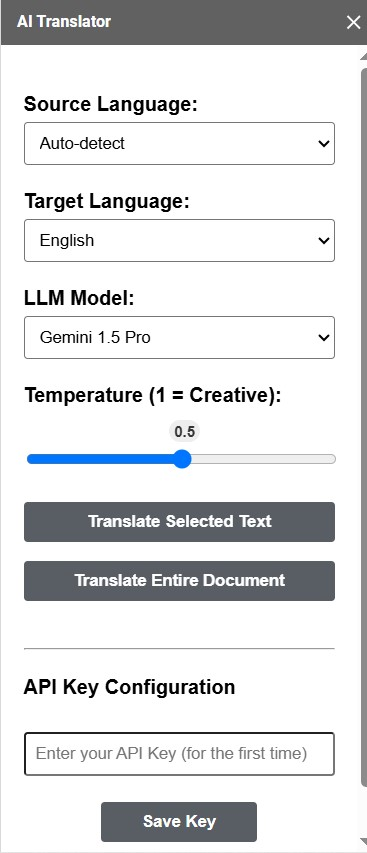

# Guide to Importing and Running the AI Translation Plugin on Google Docs (Using App Script)

[1. Introduction](#1.-introduction)

[2. Description of Code Files](#2.-description-of-code-files)

[3. Steps to Import Code into Google Apps Script](#steps-to-import-code-into-google-apps-script)

[4. Steps to Run the Code and Obtain the Add-on in Google Docs](#4.-steps-to-run-the-code-and-obtain-the-add-on-in-google-docs)

[5. Introduction and Usage Guide for the AI Translation Plugin](#5.-introduction-and-usagusage-guide-for-the-ai-translation-plugin)

## 1. Introduction

This project represents a AI translation plugin designed for seamless integration into Google Docs. The primary goal of this project is to enhance the writing experience, by enabling them to translate text between multiple languages directly within their familiar editing environment.

Compared to the assignment requirements, this plugin has successfully implemented the following key features:

* **Multi-Platform Support (Google Docs):** The plugin functions effectively on Google Docs as an add-on.
* **Sidebar-Based User Interface:** Provides a convenient sidebar for users to configure translation preferences.
* **Translation Options:** Allows users to select the source language, target language, LLM model, and temperature settings.
* **AI-Powered Translation:** Utilizes the Gemini model to ensure high-quality and context-aware translations.
* **Real-Time Translation Assistance:** Enables users to instantly translate selected text or the entire document.
* **User-Friendly Experience:** Features an intuitive and easy-to-use interface that integrates seamlessly into Google Docs.

Notably, this plugin leverages the power of Google's Gemini model, requiring users to input their API key only once upon initial use, bringing advanced translation capabilities right at their fingertips.

## 2. Description of Code Files

Below is a description of each of the main code files this project:

* **appsscript.json:** This is the manifest file for Google Apps Script project. It contains important configuration information about the add-on.

* **Code.gs:** This file contains the main source code for the plugin, written in Google Apps Script language.

* **Sidebar.html:** This HTML file contains the code to build the user interface of the add-on's sidebar.

## 3. Steps to Import Code into Google Apps Script

Follow these steps to import your code into the App Script editor:

1.  **Open Google Docs:** Go to Google Docs ([https://docs.google.com/](https://docs.google.com/)) and open any document.
2.  **Access the Script Editor:**
    * In your Google Docs document, select **Tools** from the menu bar.
    * Choose **Script editor**. A new browser tab or window will open, displaying the Google Apps Script editor.
3.  **Delete Default Code (If Any):** If this is your first time using the script editor for this document, there might be a default `myFunction()` function. You can delete this.
4.  **Copy and Paste Code:**
    * Open your App Script code file.
    * Select all the code content and copy it (Ctrl+A or Cmd+A, then Ctrl+C or Cmd+C).
    * Go back to the Google Apps Script editor.
    * Paste the copied code into the editor window (Ctrl+V or Cmd+V). Make sure you overwrite or delete any existing code before pasting.
5.  **Save the Project:**
    * Click the **Save project** icon (floppy disk icon) in the top left corner.
    * Give your project a name (e.g., "AI Translation Plugin").
    * Click **OK**.

## 4. Steps to Run the Code and Obtain the Add-on in Google Docs

After importing the code, you need to deploy it as an add-on to use it in Google Docs:

1.  **Refresh Google Docs:** After saving the code in the script editor, return to your Google Docs document and refresh the page (F5 or Cmd+R).
2.  **Check for the Add-on:**
    * After refreshing, an **Add-ons** menu will appear in the Google Docs menu bar (usually located between "Tools" and "Help").
    * Hover over the **Add-ons** menu. You should see the name of your add-on project (e.g., "AI Translation Plugin").
    * Click on the add-on name. If this is the first time you are running this add-on, Google might ask you for authorization.
3.  **Authorize the Add-on (If Required):**
    * An authorization dialog will appear. Click **Continue**.
    * Select the Google account you are using.
    * Google will display a notification about the permissions the add-on requires (e.g., view and manage documents, connect to external services if you are using translation APIs).
    * Click **Allow** to grant the add-on the necessary permissions.
4.  **Use the Add-on:** Once the authorization is successful (if needed), go back to the **Add-ons** menu, select your add-on's name, and choose the function you want to use.
5.  **Sidebar Appears:** A sidebar should appear on the right side of your Google Docs screen, allowing you to set translation preferences such as source language, target language, LLM model, and temperature.
6.  **Perform Translation:** You can go straight to the instructions in part ***5.2*** to know how to use this plugin.

## 5. Introduction and Usage Guide for the AI Translation Plugin

### 5.1. Add-in Interface

1.  **Title:** "AI Translator" - Displays the name of the plugin.
2.  **Source Language Selection:** A dropdown menu allows you to choose the original language of the text you want to translate. An "Auto-detect" option is also available for the plugin to automatically identify the source language.
3.  **Target Language Selection:** Another dropdown menu lets you select the language you want to translate the text into.
4.  **LLM Model Selection:** A dropdown where you can choose the Large Language Model (LLM) that will be used for the translation process. Currently, the plugin utilizes the **Gemini 1.5 Pro** model, ensuring high-quality and context-aware translations.
5.  **Temperature Setting:** A slider allows you to adjust the "temperature" level of the translation. The value ranges from 0 to 1, where 1 indicates higher creativity and randomness in the translation. The default value is usually 0.5.
6.  **"Translate Selected Text" Button:** Click this button after you have selected a portion of text in your document to translate that specific text.
7.  **"Translate Entire Document" Button:** Click this button to translate the entire content of the current document into the selected target language. The translation process might take some time depending on the length of the document.
8.  **API Key Configuration:**
    * **"Enter your API Key (for the first time)" Input Field:** This is where you need to enter your Gemini model API key. **Important Note:** This plugin is built to use the Gemini model, so only a Gemini API key can be entered here. You only need to enter this API key once during your first use of the plugin.
    * **"Save Key" Button:** After entering your API key, click this button to save it. The API key will be securely stored for future translations.

### 5.2. How to Use

1.  **Open the Sidebar:** After installing the add-in, open the "AI Translator" sidebar from the "Add-ons" menu.
2.  **Set Languages:** Choose your desired source and target languages. You can leave the source language as "Auto-detect" if you are unsure.
3.  **Select Model (Default is Gemini 1.5 Pro):** Select the LLM you want to use. The Gemini 1.5 Pro model is recommended for the best quality.
4.  **Adjust Temperature (Optional):** If you want the translation to have a higher degree of creativity, adjust the temperature slider.
5.  **Enter API Key (First Time Only):** If this is your first time using the plugin, enter your Gemini API key in the "Enter your API Key (for the first time)" field and click "Save Key." You won't need to do this again for subsequent uses.
6.  **Translate Text:**
    * **Translate selected text:** Select the text you want to translate in your document and click the "Translate Selected Text" button. the translation will be immediately replaced with the selected text.
    * **Translate the entire document:** If you want to translate the entire document, click the "Translate Entire Document" button. The translation process may take some time depending on the document's length.
